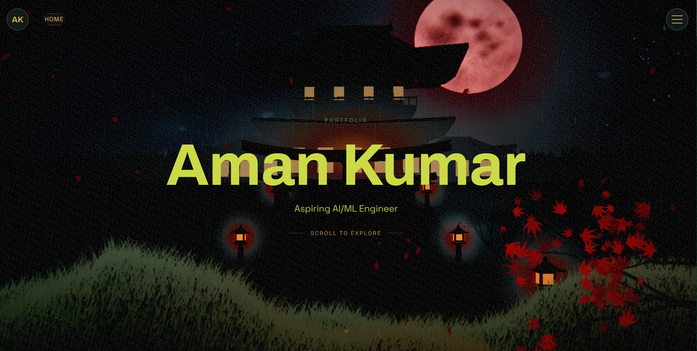

# 🌌 Aman Kumar — Interactive 3D Portfolio

[](https://aman-portfolio.vercel.app)
[](https://react.dev/)
[](https://vitejs.dev/)
[](https://threejs.org/)
[](https://gsap.com/)
[](https://tailwindcss.com/)
[](https://resend.com)

A visually-rich, interactive 3D developer portfolio built with **React 19**, **Vite 8**, **Three.js** (via `@react-three/fiber`), **GSAP 3**, and **Tailwind CSS 4**. The application seamlessly combines parallax 3D WebGL scenes, interactive physics profile cards, an industry certifications showcase slider, a serverless email delivery system via **Resend**, dynamic section color-tweening, and a staggered GSAP entry curtain.

---

## 🎬 Project Demo

> **Live Deployment:** [https://aman-portfolio.vercel.app](https://aman-portfolio.vercel.app)



### 🌟 Key Highlights & Demo Features
- 🎮 **Interactive 3D WebGL Canvas**: Real-time camera trajectory waypoint navigation synced smoothly to scroll progress.
- 🎴 **Physics-Driven 3D Profile Card**: Real-time cursor parallax tilt, hologram sheen, glare lighting effects, active status badge, and quick resume access.
- 🎓 **Certifications Carousel & Modal**: Interactive 3D slider displaying verified certificates (IBM AI, GCP Core, Kaggle ML, Python, SQL) with high-res modal previews and PDF viewing.
- 📬 **Serverless Messaging System**: Powered by **Resend API** with client & server-side validation, HTML email templates, and anti-spam honeypot defense.
- 🌀 **6 Unique Section Transitions**: Custom WebGL shader noise dissolve, SVG Bézier curve morphing, title polygon clip-paths, and curtain wipes.

---

## 📋 Table of Contents

- [Demo](#-project-demo)
- [Features](#-features)
  - [Seven Animated Sections](#seven-animated-sections)
  - [Interactive 3D Profile Card](#interactive-3d-profile-card)
  - [Certifications Showcase](#certifications-showcase)
  - [Serverless Contact System (Resend API)](#serverless-contact-system-resend-api)
  - [Immersive 3D WebGL Engine](#immersive-3d-webgl-engine)
  - [Unique Section Transitions](#unique-section-transitions)
  - [Radial & Hamburger Navigation](#radial--hamburger-navigation)
  - [Staggered GSAP Entry Loader](#staggered-gsap-entry-loader)
- [Tech Stack](#-tech-stack)
- [Architecture](#-architecture)
  - [Serverless Contact Endpoint](#serverless-contact-endpoint)
  - [Custom Decoupled Event System](#custom-decoupled-event-system)
  - [Deterministic 3D with Seeded PRNG](#deterministic-3d-with-seeded-prng)
- [Color Palette](#-color-palette)
- [Getting Started](#-getting-started)
  - [Prerequisites](#prerequisites)
  - [Installation](#installation)
  - [Environment Configuration](#environment-configuration)
  - [Development](#development)
  - [Building for Production](#building-for-production)
- [Project Structure](#-project-structure)
- [Data Model](#-data-model)
- [Accessibility](#-accessibility)
- [Dependencies](#-dependencies)

---

## ✨ Features

### Seven Animated Sections

Each section is a full-height, CSS scroll-snap panel with its own entry animation, background color transition, and visual theme:

| # | Section | Target ID | Description |
|---|---------|-----------|-------------|
| 1 | **Hero** | `hero` | Staggered GSAP character/slide-in reveal for title & scroll cue hint |
| 2 | **About** | `about` | Interactive physics-based 3D Profile Card, bio breakdown, active status badge |
| 3 | **Skills** | `skills` | Scroll-staggered skill category cards with gradient dot indicators and hover color-swaps |
| 4 | **Projects** | `projects` | Scroll-staggered project cards with glowing borders (Teal for Web, Purple for Full-Stack/Treasure) |
| 5 | **Experience** | `experience` | Interactive timeline with expanding center line and dual-sided clip-path reveals |
| 6 | **Certifications** | `certifications` | Interactive 3D certification slider with credential modals and verified PDF links |
| 7 | **Contact** | `contact` | Real serverless contact form backed by Resend API, honeypot protection & status toasts |

---

### Interactive 3D Profile Card

Located in the **About** section (`src/components/ui/ProfileCard.jsx`), this component provides an interactive developer pass experience:
- 🧊 **3D Spring & Tilt Dynamics**: Uses normalized cursor position tracking to tilt the card dynamically with smooth inertia damping.
- ✨ **Dynamic Glare & Hologram**: Realistic lighting reflection layer that follows pointer position.
- 🏷️ **Verified Badges & Status**: Displays live system status (*"Open for Roles"*), avatar overlay, social quick links, and a direct resume download action.

---

### Certifications Showcase

The **Certifications** section (`src/components/sections/Certifications.jsx` & `src/components/ui/CertificationSlider.jsx`) features a custom multi-card slider showcasing industry credentials:
- 📜 **Verified Credentials**: IBM AI Fundamentals, Google Cloud Core Infrastructure, Kaggle Intermediate Machine Learning, Python Specialization (Univ of Michigan), Microsoft SQL Foundations & SQL Server Transactions, NVIDIA Networking.
- 🖼️ **Interactive Modals**: Full-screen image/PDF preview modal with Credly & Coursera direct verification links.
- ⌨️ **Keyboard & Mouse Control**: Supports drag sliding, arrow navigation, and responsive touch swipes.

---

### Serverless Contact System (Resend API)

The **Contact** section (`src/components/sections/Contact.jsx`) connects directly to a serverless backend function (`api/contact.js`):
- ✉️ **Real Email Delivery**: Integrated with the **Resend API** to instantly dispatch incoming inquiries to the developer's inbox (`apk355194@gmail.com`).
- 🔒 **Security & Validation**: Includes server-side HTML escaping (`escapeHtml`), input string length bounds, strict email regex checking, and a hidden `_honeypot` field to drop spam bots silently.
- 🎨 **Responsive HTML Email Template**: Clean inline-styled HTML layout dispatched to inbox for easy reply-to tracking.

---

### Immersive 3D WebGL Engine

A fixed `<Canvas>` from `@react-three/fiber` renders a background 3D parallax scene. `SceneManager` smoothly lerps camera positions through predefined section waypoints (`CAMERA_SECTIONS`) on scroll:

| Component | Description |
|-----------|-------------|
| `ParticleField` | 1,200 seeded-random particles with additive blending that rotate on scroll and offset toward cursor |
| `OrganicMorph` | Animated icosahedron mesh with vertex displacement noise, solid emissive mesh & wireframe shell |
| `SkillCell` | Floating spheres with additive-glow shells, arranged radially with index-staggered cadence |
| `ProjectCrystal` | Distorted octahedra with inner glow, wireframe shell, and floating Y-axis rotation — one per project |
| `ExperienceVine` | Catmull-Rom curve vine with mirrored leaf pairs appearing progressively with scroll progress |

---

### Unique Section Transitions

`TransitionOverlay` serves as the transition engine. Each section movement activates a distinct visual technique:

| # | Trigger Section | Technique | Color Palette |
|---|-----------------|-----------|---------------|
| 1 | **Home / Hero** | Scale & inset-clip-path wipe veil | `#F2b759` (Amber) |
| 2 | **About** | WebGL ShaderMaterial value-noise dissolve | `#f2efe7` (Off-White) |
| 3 | **Skills** | SVG Bézier curve morphing | `#8b004a` (Deep Magenta) |
| 4 | **Projects** | Dynamic title overlay with polygon clip-path | `#00a19b` (Teal) |
| 5 | **Experience** | GSAP Draw SVG spiral stroke animation | `#D4A853` (Amber) |
| 6 | **Certifications** | Staggered horizontal curtain slide | `#5A7D6E` (Moss Green) |
| 7 | **Contact** | Dual clip-path curtain lift | `#C87740` (Warm Orange) |

---

### Radial & Hamburger Navigation

- **`Navbar`**: Arc layout displaying active sections with CSS counter numbering (`01`–`07`). Responds to mouse wheel and arrow keys.
- **`HamburgerNav` & `StaggeredMenu`**: Full-screen hamburger menu featuring staggered item reveals, GitHub & LinkedIn links, and layered parallax backdrops.

---

### Staggered GSAP Entry Loader

Full-screen entry curtain sequence (`src/components/ui/Loader.jsx`):
- Character reveal animation for *"AMAN"* / *"PORTFOLIO"*
- `0%` to `100%` numeric counter with progress track
- Smooth liquid SVG curtain exit timing once initial assets resolve

---

## 🛠️ Tech Stack

| Category | Technology | Description |
|----------|------------|-------------|
| **Core Framework** | React 19 (`19.2.6`) | Component model & state management |
| **Build System** | Vite 8 (`8.0.12`) | HMR, ES module bundling & asset pipelines |
| **Styling** | Tailwind CSS 4 (`4.3.1`) | Utility-first styling & CSS variables |
| **3D Rendering** | Three.js (`0.184`) | WebGL rendering via `@react-three/fiber` & `@react-three/drei` |
| **Animations** | GSAP 3 (`3.15.0`) | High-performance scroll timeline orchestration & loaders |
| **Menu Physics** | Framer Motion (`12.40`) | Staggered menu reveals & UI gestures |
| **Serverless Email** | Resend API (`@resend/node`) | Production-ready transactional email delivery |
| **Hosting & API** | Vercel | Production CDN & Vercel Serverless Functions |

---

## 📐 Architecture

### Serverless Contact Endpoint

```
User Contact Form Submission
          │
          ▼
   POST /api/contact
          │
   ┌──────┴─────────────────────────────────┐
   │ 1. Validate JSON payload & method     │
   │ 2. Honeypot anti-spam verification    │
   │ 3. Input length & regex sanitization  │
   │ 4. Escape HTML to prevent injection   │
   └──────┬─────────────────────────────────┘
          │
          ▼
    Resend Client Node SDK (RESEND_API_KEY)
          │
          ▼
   Dispatches HTML Email to Target Inbox
```

### Custom Decoupled Event System

Navigation events bypass props drilling via a native `CustomEvent` architecture:

1. **Dispatch**: `src/utils/navigation.js` defines `triggerSectionTransition(target, label)`, dispatching `'trigger-section-transition'` on `window`.
2. **Listener**: `TransitionOverlay.jsx` receives the event and executes targeted GSAP transition routines.

### Deterministic 3D with Seeded PRNG

To prevent 3D geometry jitter between re-renders, floating objects use a **seeded xorshift PRNG** (`src/utils/random.js`):

```javascript
export function createSeededRandom(seed) {
  let state = seed >>> 0;
  return function () {
    state ^= state << 13;
    state ^= state >> 17;
    state ^= state << 5;
    return ((state >>> 0) / 4294967296);
  };
}
```

---

## 🎨 Color Palette

Configured in `src/constants/colors.js` and exposed via Tailwind CSS tokens:

| Name | Hex Code | Primary Usage |
|------|----------|---------------|
| **Amber** | `#D4A853` | Primary brand accent, skill highlights, selection borders |
| **Moss** | `#5A7D6E` | Scrollbar indicators, secondary UI elements |
| **Purple** | `#7C6FE0` | Full-stack & AI/ML tags |
| **Teal** | `#00A19B` | Projects transition, primary live badges |
| **Dark Green** | `#0A3625` | Deep canvas background base |
| **Magenta** | `#8b004a` | Skills section transition accent |
| **Warm Orange** | `#C87740` | Contact section transition accent |
| **Off-White** | `#F2EFE7` | Light section text & overlay background |

---

## 🚀 Getting Started

### Prerequisites

- **Node.js** >= `20.0.0`
- **npm** or **pnpm** / **yarn**

### Installation

```bash
# Clone repository
git clone https://github.com/AmanKumar-St/aman-portfolio.git

# Navigate into project directory
cd aman-portfolio

# Install dependencies
npm install
```

### Environment Configuration

Create a `.env` file in the root directory (see `.env.example`):

```env
# Resend API key for contact form submission
RESEND_API_KEY=re_your_api_key_here

# Destination email where contact messages are delivered
CONTACT_EMAIL=apk355194@gmail.com
```

> [!NOTE]
> For local testing of `/api/contact`, Vite dev server proxies `/api` requests automatically. Ensure `RESEND_API_KEY` is specified in `.env`.

### Development

```bash
npm run dev
```

Starts the local development server at `http://localhost:5173`.

### Building for Production

```bash
# Build optimized production bundle
npm run build

# Preview production build locally
npm run preview
```

---

## 📁 Project Structure

```
aman-portfolio/
├── api/
│   └── contact.js                # Serverless function for Resend email sending
├── public/
│   ├── favicon.svg
│   ├── icons.svg
│   └── portfolio-demo.png         # README preview image banner
├── src/
│   ├── assets/                   # Profile image, cert PNGs/PDFs & media
│   │   ├── Profile_pic-bg.png
│   │   └── certifications/       # PNG previews & PDF certificates
│   ├── components/
│   │   ├── sections/
│   │   │   ├── Hero.jsx
│   │   │   ├── About.jsx
│   │   │   ├── Skills.jsx
│   │   │   ├── Projects.jsx
│   │   │   ├── Experience.jsx
│   │   │   ├── Certifications.jsx # Certifications section container
│   │   │   └── Contact.jsx        # Contact form with Resend integration
│   │   ├── three/
│   │   │   ├── SceneCanvas.jsx    # WebGL canvas wrapper
│   │   │   ├── SceneManager.jsx   # 3D camera controller & waypoints
│   │   │   ├── ParticleField.jsx
│   │   │   ├── OrganicMorph.jsx
│   │   │   ├── SkillCell.jsx
│   │   │   ├── ProjectCrystal.jsx
│   │   │   └── ExperienceVine.jsx
│   │   └── ui/
│   │       ├── Navbar.jsx         # Radial section navigation
│   │       ├── HamburgerNav.jsx   # Fullscreen menu toggle
│   │       ├── StaggeredMenu.jsx  # Framer Motion overlay menu
│   │       ├── ProfileCard.jsx    # Interactive 3D mouse-tilt profile card
│   │       ├── CertificationSlider.jsx # Multi-card slider with modals
│   │       ├── TransitionOverlay.jsx   # GSAP & WebGL section transitions
│   │       ├── Loader.jsx         # GSAP entry curtain
│   │       └── Footer.jsx
│   ├── constants/
│   │   ├── colors.js
│   │   ├── nav.js                 # 7 navigation section items
│   │   └── scene.js
│   ├── data/
│   │   ├── content.js             # Personal bio, skills & projects data
│   │   └── certifications.js      # Certification entries with asset links
│   ├── hooks/
│   │   ├── useScrollProgress.js
│   │   ├── useSectionBackground.js
│   │   └── useReducedMotion.js
│   ├── utils/
│   │   ├── random.js              # Seeded PRNG for 3D stability
│   │   └── navigation.js          # Transition event dispatcher
│   ├── App.jsx
│   ├── main.jsx
│   └── index.css                  # Global Tailwind 4 styling & tokens
├── .env.example
├── package.json
├── vite.config.js
└── README.md
```

---

## 📊 Data Model

All portfolio content is modularly managed in `src/data/content.js` and `src/data/certifications.js`:

```javascript
// Data shape for Certifications showcase (src/data/certifications.js)
export const certifications = [
  {
    id: 'ibm-ai-fundamentals',
    name: 'Artificial Intelligence Fundamentals',
    issuer: 'IBM SkillsBuild',
    issueDate: 'Jan 30, 2026',
    credentialId: 'dda8d923-fa5e-47ef-84b3-1eaea26f9f7e',
    credentialUrl: 'https://www.credly.com/badges/dda8d923-fa5e-47ef-84b3-1eaea26f9f7e',
    image: ibmAIFundamentalsImg,
    pdf: ibmAIFundamentalsPdf,
  },
  // ...
];
```

---

## ♿ Accessibility

- ⚡ `prefers-reduced-motion` media queries disable intense WebGL rotation, heavy tilt animations, and radial navigation transforms.
- 🏷️ Complete `aria-label` attributes across interactive 3D triggers, slider controls, and navigation buttons.
- 🎨 High-contrast color palette adhering to WCAG guidelines for dark interfaces.

---

## 📦 Dependencies

| Package | Version | Purpose |
|---------|---------|---------|
| `react` | `^19.2.6` | UI Component framework |
| `vite` | `^8.0.12` | Next-gen dev server & bundler |
| `three` | `^0.184.0` | 3D WebGL engine |
| `@react-three/fiber` | `^9.6.1` | React renderer for Three.js |
| `@react-three/drei` | `^10.7.7` | Helper utilities for `@react-three/fiber` |
| `gsap` | `^3.15.0` | Scroll-triggered timelines & page transitions |
| `@gsap/react` | `^2.1.2` | GSAP hooks integration for React |
| `framer-motion` | `^12.40.0` | Hamburger menu staggered animations |
| `resend` | `^6.9.3` | Serverless email delivery SDK |
| `tailwindcss` | `^4.3.1` | Utility CSS engine |

---

<p center align="center">
  Crafted with ❤️ by <strong>Aman Kumar</strong>
</p>

